# Nyaya.ai Documentation

This document describes the active root workspace at `/Users/devanshusharma/Desktop/projects/nyaya-ai-main`. A nested `nyayaAI-main/` folder also exists, but I treat that as a secondary snapshot because the root app is the one currently wired to the live Next.js workspace.

## Snapshot

| Dimension | Summary |
|---|---|
| Product | Indian legal AI assistant with chat, document generation, lawyer discovery, KYR content, consultation booking, and community stories |
| Runtime | Next.js App Router monolith |
| Auth | Supabase Auth |
| Database | Supabase Postgres with RLS |
| AI | Puter.js loaded in the browser, plus server-route references to Puter-style AI helpers |
| Status | Prototype / active development |

## 1. Project Overview

Nyaya.ai is a legal-assistance web application focused on Indian law. It combines an AI legal chat assistant, document generation, lawyer discovery, Know Your Rights content, consultation booking, user dashboards, and anonymous legal-story sharing into one browser-based product. The active app shell is built with Next.js and React, and the root layout loads Puter.js from a CDN so the assistant can answer questions without a separate AI backend service.

The platform is aimed at users who need an accessible first step into the legal system: citizens trying to understand rights, people drafting first-pass legal documents, users looking for a lawyer, and users who want to read or share legal experiences. The codebase frames AI output as general information rather than legal advice, and several flows intentionally gate real actions behind authentication and Supabase permissions.

Current status: prototype. That assessment is based on the `metadata.generator = "v0.app"` marker in [app/layout.tsx](app/layout.tsx), the presence of overlapping schema families, the lack of a test suite, and build settings that suppress TypeScript and lint errors.

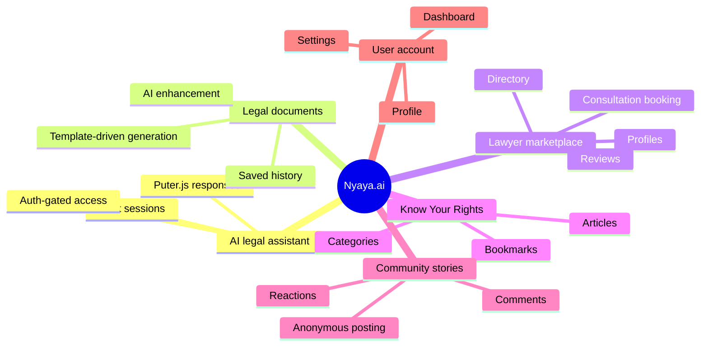

Architecture prompt for an image tool: a calm, modern legal-tech dashboard split into five illustrated panels, one each for AI chat, document drafting, lawyer search, rights articles, and community stories, with a Supabase database cylinder and a small AI cloud connected behind the scenes.

## 2. Architecture & Design

The application is a monolith in the Next.js App Router sense: route pages, route handlers, shared libraries, and UI components all live in one repository and ship together. There are no independently deployed microservices, queues, or worker processes in the active root workspace. Backend logic is split between server-side route handlers in `app/api/**`, server components that query Supabase, and browser-side components that call the Supabase client directly.

The main design patterns are:

- App Router composition: `app/**/page.tsx` files own route-level orchestration.
- Thin route handlers: API files validate request bodies, check auth, and perform one focused task.
- Client/server split: pages fetch data on the server, interactive widgets run on the client.
- RLS-first data access: Supabase policies are the primary authorization boundary.
- View-model mapping: pages often reshape database rows before passing them to presentation components.

The data flow is mostly browser -> middleware -> server page or route -> Supabase -> rendered UI. For the AI chat and document features, the browser also talks to Puter.js or to a document-enhancement endpoint, and then stores the result back into Supabase.

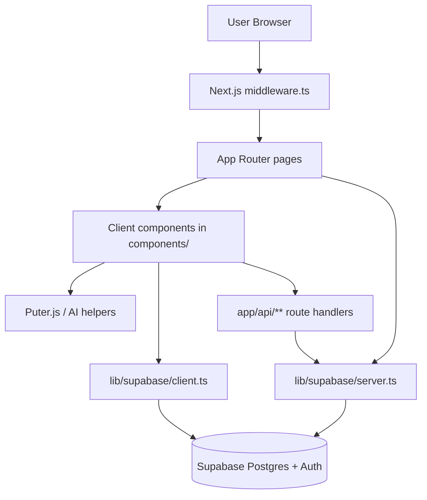

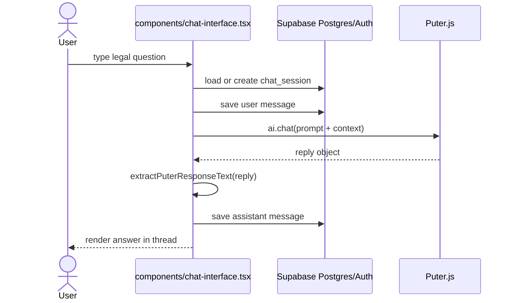

Representative code from the app shell in [app/layout.tsx](app/layout.tsx):

```tsx
<head>
  <script src="https://js.puter.com/v2/" async />
</head>
```

Representative server auth boundary from [lib/supabase/middleware.ts](lib/supabase/middleware.ts):

```ts
if (
  !user &&
  (request.nextUrl.pathname.startsWith("/dashboard") ||
    request.nextUrl.pathname.startsWith("/chat") ||
    request.nextUrl.pathname.startsWith("/documents") ||
    request.nextUrl.pathname.startsWith("/lawyers"))
) {
  const url = request.nextUrl.clone()
  url.pathname = "/auth/login"
  return NextResponse.redirect(url)
}
```

## 3. Tech Stack

The repository is TypeScript-heavy, with SQL for schema setup and Markdown for documentation. The active root `package.json` declares Node `>=18`.

| Area | Packages / tools | Version in repo |
|---|---|---|
| Runtime | Node.js | `>=18` |
| App framework | `next`, `react`, `react-dom` | `latest`, `latest`, `latest` |
| Language | `typescript` | `^5` |
| Auth / data | `@supabase/ssr`, `@supabase/supabase-js` | `latest`, `latest` |
| UI primitives | `@radix-ui/*` | `1.1.x` to `2.2.x` depending on package |
| Styling | `tailwindcss`, `@tailwindcss/postcss`, `postcss`, `autoprefixer`, `tailwindcss-animate`, `tw-animate-css` | `^4.1.9`, `^4.1.9`, `^8.5`, `^10.4.20`, `^1.0.7`, `1.3.3` |
| Motion / charts | `framer-motion`, `recharts` | `latest`, `2.15.4` |
| Forms / validation | `react-hook-form`, `@hookform/resolvers`, `zod` | `^7.60.0`, `^3.10.0`, `3.25.67` |
| Utilities | `clsx`, `tailwind-merge`, `class-variance-authority`, `date-fns`, `lucide-react`, `sonner`, `next-themes`, `cmdk`, `vaul`, `embla-carousel-react`, `react-day-picker`, `input-otp`, `geist` | mixed |

The root code uses Supabase Postgres for persistence and auth, browser `localStorage` for selected language preferences, and the `public/` folder for static assets. The root layout also injects Puter.js from `https://js.puter.com/v2/`.

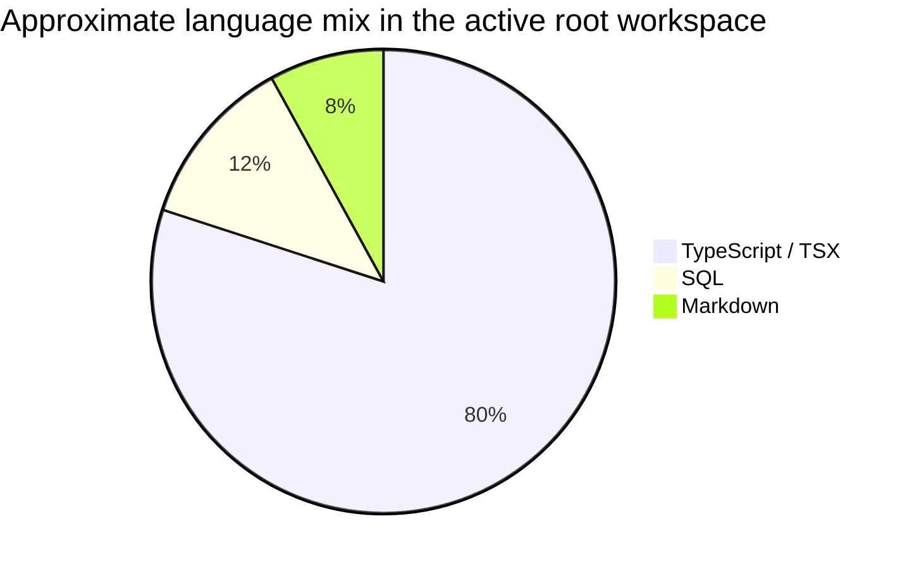

These percentages are approximate, based on the file mix in the active root workspace rather than a line-count audit.

## 4. Project Structure

Top level, the repository is organized around the Next.js app, shared UI, Supabase helpers, and SQL setup scripts. The nested `nyayaAI-main/` directory mirrors a previous snapshot and should be treated as a secondary copy unless you are explicitly comparing histories.

```text
nyaya-ai-main/
├─ app/                     Next.js App Router pages, layouts, and API routes
├─ components/              Feature components and reusable UI
│  └─ ui/                   Radix/shadcn-style primitives
├─ hooks/                   Shared React hooks
├─ lib/                     Supabase clients, i18n, utilities, AI helpers
├─ public/                  Static files and exported docs
├─ scripts/                 Supabase SQL schema, seed, and policy scripts
├─ styles/                  Legacy/global CSS assets
├─ DOCUMENTATION.md         This file
├─ README.md                Short project summary and setup notes
├─ env.example              Environment variable template
├─ middleware.ts            Auth/session refresh middleware
├─ next.config.mjs         Next.js config
├─ tsconfig.json           TypeScript config
├─ postcss.config.mjs      Tailwind/PostCSS config
├─ components.json         shadcn/ui config
└─ nyayaAI-main/           Nested duplicate snapshot
```

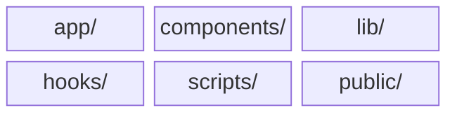

Major modules and what they do:

| Path | Purpose |
|---|---|
| [app/layout.tsx](app/layout.tsx) | Root HTML shell, fonts, theme provider, i18n provider, Puter.js script injection |
| [middleware.ts](middleware.ts) | Session refresh and route protection |
| [lib/supabase/server.ts](lib/supabase/server.ts) | Server-side Supabase client factory |
| [lib/supabase/client.ts](lib/supabase/client.ts) | Browser Supabase client factory |
| [lib/supabase/middleware.ts](lib/supabase/middleware.ts) | Supabase session refresh and auth redirects |
| [lib/puter-response.ts](lib/puter-response.ts) | Normalizes different AI response shapes into text |
| [lib/i18n/translations.ts](lib/i18n/translations.ts) | Translation dictionary for `en`, `hi`, `mr`, `te` |
| [components/chat-interface.tsx](components/chat-interface.tsx) | Authenticated AI chat UI and session persistence |
| [components/document-generator.tsx](components/document-generator.tsx) | Template filling, preview, AI enhancement, save/download |
| [components/lawyer-directory.tsx](components/lawyer-directory.tsx) | Lawyer search/filter/sort directory |
| [components/lawyer-profile.tsx](components/lawyer-profile.tsx) | Lawyer detail page and consultation entry points |
| [components/consultation-booking.tsx](components/consultation-booking.tsx) | Consultation request and payment simulation flow |
| [components/kyr-browse.tsx](components/kyr-browse.tsx) | KYR category browser |
| [components/kyr-category-view.tsx](components/kyr-category-view.tsx) | KYR articles within a category |
| [components/kyr-article-view.tsx](components/kyr-article-view.tsx) | Single article view, sharing, bookmarking |
| [components/stories-directory.tsx](components/stories-directory.tsx) | Legal story feed and filters |
| [components/story-view.tsx](components/story-view.tsx) | Story detail page, likes, comments, deletion |
| [components/story-share-form.tsx](components/story-share-form.tsx) | Story submission form |
| [components/history-view.tsx](components/history-view.tsx) | Unified history for chats, documents, bookmarks |
| [components/user-dashboard.tsx](components/user-dashboard.tsx) | Consultation dashboard and review history |
| [components/user-settings.tsx](components/user-settings.tsx) | Settings, profile, notifications, account deletion |

Non-obvious naming conventions:

- Route params use bracket folders such as `[id]`, `[slug]`, `[category]`, `[template]`, and `[conversationId]`.
- Some component files are kebab-case, while others are PascalCase (`Footer.tsx`, `Header.tsx`).
- Database naming is not fully uniform: the code references both `users` and `user_profiles`, and both `bookmarks` and `user_bookmarks` appear in different scripts.

## 5. Setup & Installation

Prerequisites:

- Node.js 18 or newer.
- npm is the clearest fit for the active root because the root workspace contains `package-lock.json` and npm scripts.
- A Supabase project with URL and anon key.
- Internet access for the Puter.js CDN.

Local setup:

```bash
git clone <repo>
cd nyaya-ai-main
npm install
cp env.example .env.local
npm run dev
```

Database setup is not automatic. The root docs and SQL scripts indicate that you must run the Supabase scripts manually in order. The active code references the following data families:

- `users`, `legal_categories`, `legal_documents`, `chat_sessions`, `chat_messages`, `lawyers`
- `kyr_articles`, `bookmarks`
- `legal_stories`, `story_comments`, `story_likes`, `story_categories`
- `lawyer_specializations`, `lawyer_specialization_mapping`, `consultation_requests`, `lawyer_reviews`

Environment variables:

| Key | Required by | Description | Example |
|---|---|---|---|
| `NEXT_PUBLIC_SUPABASE_URL` | browser, server, middleware | Supabase project URL | `https://xyzcompany.supabase.co` |
| `NEXT_PUBLIC_SUPABASE_ANON_KEY` | browser, server, middleware | Public Supabase anon key | `eyJhbGciOi...` |
| `SUPABASE_SERVICE_ROLE_KEY` | docs / legacy setup | Service role key listed in docs, not used in the active root source I inspected | `service-role-key` |
| `NEXT_PUBLIC_APP_URL` | docs | Base URL for the app | `http://localhost:3000` |
| `NEXT_PUBLIC_DEV_SUPABASE_REDIRECT_URL` | [app/auth/signup/page.tsx](app/auth/signup/page.tsx) | Optional override for signup email redirect | `http://localhost:3000/dashboard` |

Run commands:

```bash
npm run dev
npm run build
npm run start
npm run lint
```

The repo does not currently define a test script, so `npm test` is not configured.

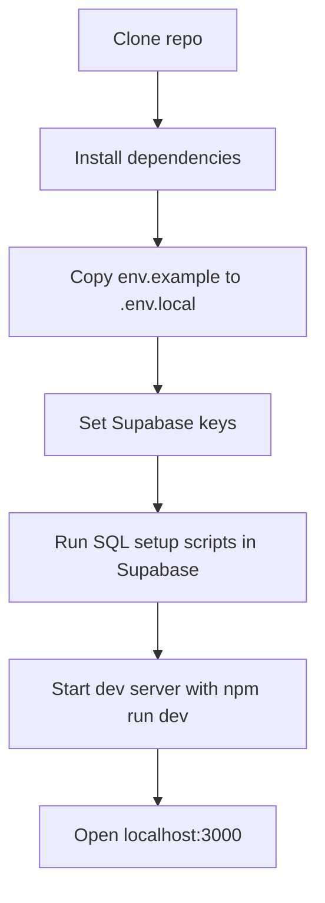

## 6. Configuration

### Main config files

| File | What it controls |
|---|---|
| [next.config.mjs](next.config.mjs) | Image optimization, TypeScript build behavior, lint behavior |
| [tsconfig.json](tsconfig.json) | TypeScript strictness, path aliases, module resolution |
| [postcss.config.mjs](postcss.config.mjs) | Tailwind/PostCSS processing |
| [components.json](components.json) | shadcn/ui component generation conventions |
| [middleware.ts](middleware.ts) | Route protection and session refresh |
| [app/layout.tsx](app/layout.tsx) | Theme provider, i18n provider, fonts, Puter.js script |

### Notable keys

- `typescript.ignoreBuildErrors` in `next.config.mjs` suppresses TypeScript build failures.
- `eslint.ignoreDuringBuilds` is present in `next.config.mjs`, but the active Next.js toolchain reports this key as unsupported.
- `images.unoptimized` disables Next.js image optimization.
- `paths` in `tsconfig.json` maps `@/*` to the repo root.
- `suppressHydrationWarning` is used in the root layout on both `<html>` and `<body>`.

### Environment behavior

- Development uses `.env.local`.
- Authenticated sections are protected by middleware and by page-level redirects.
- Signup redirects can fall back to the browser origin plus `/dashboard`.
- The app is theme-aware through `next-themes`, but the default theme is light.

### Feature flags

No explicit feature-flag system was found in the active root workspace.

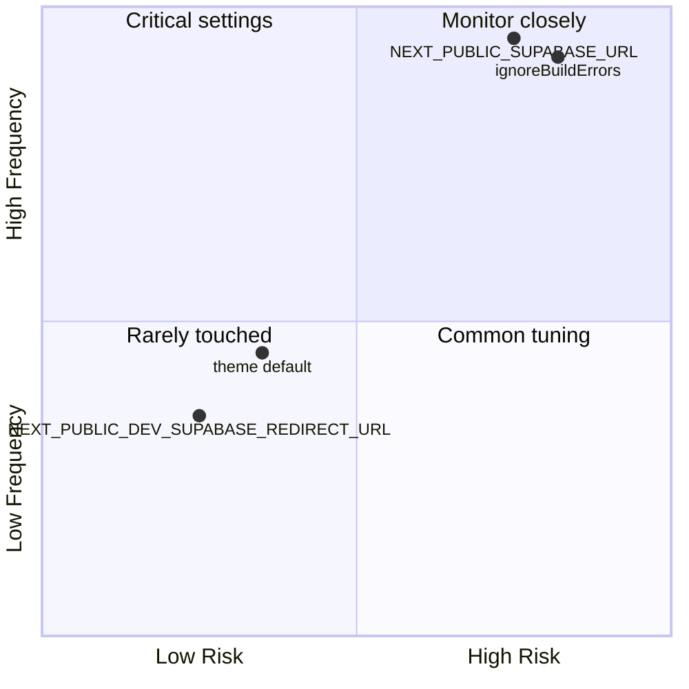

## 7. Database Schema

The repository contains multiple overlapping schema families. The active app code primarily uses the following tables:

### Active root tables referenced by code

| Table | Key columns | Notes |
|---|---|---|
| `users` | `id`, `email`, `full_name`, `phone`, `date_of_birth`, `location`, `profession`, `created_at`, `updated_at` | Used by [components/user-settings.tsx](components/user-settings.tsx) and [app/dashboard/profile/page.tsx](app/dashboard/profile/page.tsx) |
| `chat_sessions` | `id`, `user_id`, `title`, `created_at`, `updated_at` | Used by chat and history pages |
| `chat_messages` | `id`, `session_id`, `content`, `role`, `created_at` | Used by chat history and AI conversation persistence |
| `document_templates` | `id`, `title`, `description`, `category`, `complexity`, `estimated_time`, `slug`, `icon`, `popular`, `fields`, `template_content` | Loaded by document generation UI |
| `generated_documents` | `id`, `user_id`, `template_id`, `title`, `content`, `form_data`, `created_at`, `updated_at` | Saved by document generation and shown in history |
| `kyr_articles` | `id`, `title`, `slug`, `category`, `summary`, `content`, `read_time`, `difficulty`, `tags`, `created_at`, `updated_at` | The live KYR article store used by the browser views |
| `bookmarks` | `id`, `user_id`, `article_id`, `created_at` | Used by KYR article bookmarking |
| `lawyers` | `id`, `user_id`, `full_name`, `email`, `phone`, `profile_image`, `bio`, `experience_years`, `bar_council_number`, `practice_areas`, `languages`, `location`, `consultation_fee`, `rating`, `total_reviews`, `is_verified`, `is_available`, `created_at`, `updated_at` | Used by lawyer directory, profile, and consultation booking |
| `lawyer_specializations` | `id`, `name`, `description`, `icon`, `created_at` | Shared lookup table |
| `lawyer_specialization_mapping` | `id`, `lawyer_id`, `specialization_id`, `created_at` | Many-to-many bridge |
| `consultation_requests` | `id`, `user_id`, `lawyer_id`, `subject`, `description`, `preferred_date`, `preferred_time`, `consultation_type`, `status`, `created_at`, `updated_at` | Consultation booking lifecycle |
| `lawyer_reviews` | `id`, `user_id`, `lawyer_id`, `consultation_request_id`, `rating`, `review_text`, `created_at` | Rating and review system |
| `legal_stories` | `id`, `user_id`, `title`, `content`, `case_type`, `location`, `outcome`, `is_anonymous`, `is_approved`, `is_featured`, `view_count`, `like_count`, `comment_count`, `tags`, `created_at`, `updated_at` | Community legal stories |
| `story_comments` | `id`, `story_id`, `user_id`, `parent_comment_id`, `content`, `is_anonymous`, `is_approved`, `like_count`, `created_at`, `updated_at` | Story comments |
| `story_likes` | `id`, `story_id`, `user_id`, `created_at` | Story reactions |
| `story_categories` | `id`, `name`, `description`, `icon`, `color`, `created_at` | Story category lookup |
| `story_category_mapping` | `id`, `story_id`, `category_id`, `created_at` | Story/category bridge |

### Older or parallel schema families

The SQL scripts also define earlier or alternative schemas such as `legal_categories`, `legal_documents`, `case_stories`, `case_story_comments`, `case_story_reactions`, `legal_articles`, and `user_bookmarks`. These are useful historical references, but the active root UI code I inspected mostly points at the newer `kyr_articles`, `bookmarks`, `legal_stories`, `story_comments`, and `lawyer_*` tables.

### Relationships

- `users` 1 -> N `generated_documents`
- `users` 1 -> N `chat_sessions`
- `chat_sessions` 1 -> N `chat_messages`
- `users` 1 -> N `bookmarks`
- `kyr_articles` 1 -> N `bookmarks`
- `lawyers` N <-> N `lawyer_specializations` through `lawyer_specialization_mapping`
- `users` 1 -> N `consultation_requests`
- `lawyers` 1 -> N `consultation_requests`
- `consultation_requests` 1 -> N `lawyer_reviews` in practice, though the table allows one review per user/lawyer/request triple
- `legal_stories` 1 -> N `story_comments`
- `legal_stories` 1 -> N `story_likes`
- `story_comments` 1 -> N `comment_likes`
- `story_categories` N <-> N `legal_stories` through `story_category_mapping`

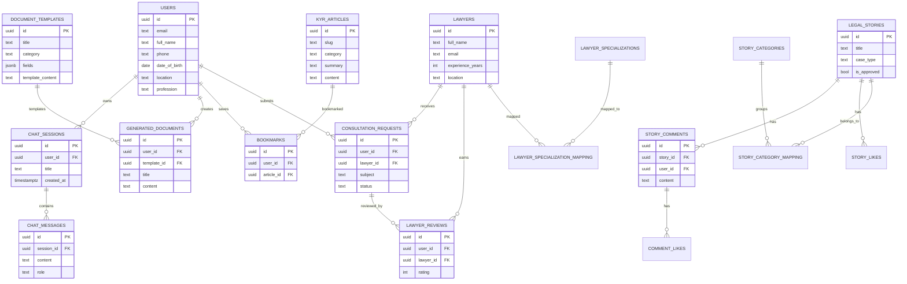

Migration strategy:

- The numbered SQL scripts under `scripts/` look like an incremental setup history.
- `020_complete_setup.sql` is the most consolidated setup file in the numbered scripts I inspected.
- `setup_legal_stories.sql` and `setup_lawyer_database.sql` appear to be the canonical setups for the richer feature families.
- The root app currently tolerates missing tables in some places by falling back to in-memory defaults or by surfacing setup guidance.

## 8. API Reference

The active root API surface consists of five route handlers.

| Method | Path | Auth | Return shape | Notes |
|---|---|---|---|---|
| `POST` | `/api/chat` | Required | Plain text | Sends the system prompt and user message to Puter.js, then returns `reply.output_text` as text/plain |
| `POST` | `/api/chat/start` | Required | `{ conversationId }` | Creates or reuses a lawyer conversation and inserts an initial message |
| `POST` | `/api/enhance-document` | Required | Plain text | Template-specific text enhancer using string substitutions, not an external AI call |
| `POST` | `/api/documents/enhance` | Required | `{ enhanced_content }` | Sends a prompt to Puter.js and returns JSON |
| `GET` / `POST` | `/api/bookmarks` | Required | JSON | GET lists a user’s bookmarks; POST toggles a bookmark for a KYR article |

### `/api/chat`

- File: [app/api/chat/route.ts](app/api/chat/route.ts)
- Function: `POST(request: NextRequest)`
- Request body: `{ message: string, sessionId?: string }`
- Response: plain text AI answer

Behavior:

1. Validates `message`.
2. Loads the authenticated user with Supabase.
3. Optionally fetches the last 10 messages from `chat_messages` for context.
4. Builds a legal-system prompt in English focused on Indian law.
5. Calls `global.puter.ai.chat(systemPrompt)`.
6. Returns `reply.output_text`.

Example request:

```http
POST /api/chat
Content-Type: application/json

{"message":"What are my tenant rights in Mumbai?","sessionId":"..."}
```

Example response:

```text
Under Indian law, tenants generally have rights related to notice, habitability, and refund of security deposit...
```

### `/api/chat/start`

- File: [app/api/chat/start/route.ts](app/api/chat/start/route.ts)
- Function: `POST(request: NextRequest)`
- Request body: `{ lawyerId: string }`
- Response: `{ conversationId: string }`

Behavior:

1. Checks auth.
2. Searches for an existing `chat_conversations` row for the same user and lawyer.
3. If found, returns that conversation ID.
4. Otherwise inserts a new conversation and seeds an opening user message.

### `/api/enhance-document`

- File: [app/api/enhance-document/route.ts](app/api/enhance-document/route.ts)
- Function: `POST(request: NextRequest)`
- Request body: `{ content, template_name, form_data }`
- Response: `{ enhanced_content: string }`

Behavior:

1. Checks auth through Supabase.
2. Creates a prompt that asks for Indian-law-aware improvements.
3. Calls `global.puter.ai.chat(prompt)`.
4. Returns the enhanced text as JSON.

### `/api/documents/enhance`

- File: [app/api/documents/enhance/route.ts](app/api/documents/enhance/route.ts)
- Function: `POST(request: NextRequest)`
- Request body: `{ content, template, formData }`
- Response: plain text

Behavior:

1. Checks auth.
2. Calls the helper `enhanceDocumentWithAI(content, template, formData)` in the same file.
3. The file’s main enhancer is a rules-based string transformer that adds or rewrites clauses for rental agreements, employment contracts, NDAs, partnerships, legal notices, and powers of attorney.

### `/api/bookmarks`

- File: [app/api/bookmarks/route.ts](app/api/bookmarks/route.ts)
- Functions: `GET(request: NextRequest)`, `POST(request: NextRequest)`
- POST body: `{ articleId: string }`
- GET response: `{ bookmarks: [...] }`
- POST response: success object with `action: "added" | "removed"`

Behavior:

1. Checks auth.
2. `GET` joins `bookmarks` with `kyr_articles`.
3. `POST` toggles the bookmark row for the signed-in user.

Auth flow sequence:

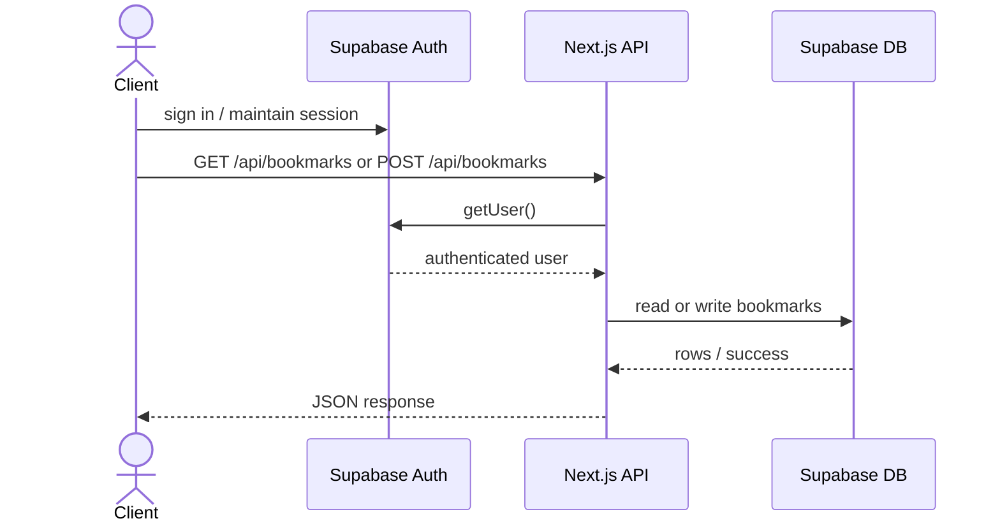

### Authentication and authorization

- Auth is Supabase Auth.
- Middleware refreshes the session and blocks unauthenticated access to protected routes.
- Most page-level data fetches also call `auth.getUser()` again on the server.
- RLS policies in Supabase are the real data guardrails.

## 9. Key Algorithms & Business Logic

The most important logic in this codebase is product logic around persistence, prompting, filtering, and access control.

### 1) Chat session lifecycle

[components/chat-interface.tsx](components/chat-interface.tsx) loads a user’s sessions, creates a new one if needed, appends the user message locally, persists the message to `chat_messages`, waits for Puter.js, extracts the text response with [`extractPuterResponseText`](lib/puter-response.ts), then stores the assistant reply.

```mermaid
flowchart TD
  A[User submits question] --> B{Session exists?}
  B -- no --> C[Create chat_sessions row]
  B -- yes --> D[Load chat_messages history]
  C --> E[Save user message]
  D --> E
  E --> F[Wait for window.puter.ai]
  F --> G[Call ai.chat(prompt)]
  G --> H[Normalize response with extractPuterResponseText]
  H --> I[Save assistant message]
  I --> J[Render conversation]
```

### 2) Document generation and enhancement

[components/document-generator.tsx](components/document-generator.tsx) loads a template by slug, replaces `{fieldId}` placeholders with form values, previews the result, optionally sends it to `/api/enhance-document`, and saves the final text to `generated_documents` when downloaded or explicitly saved.

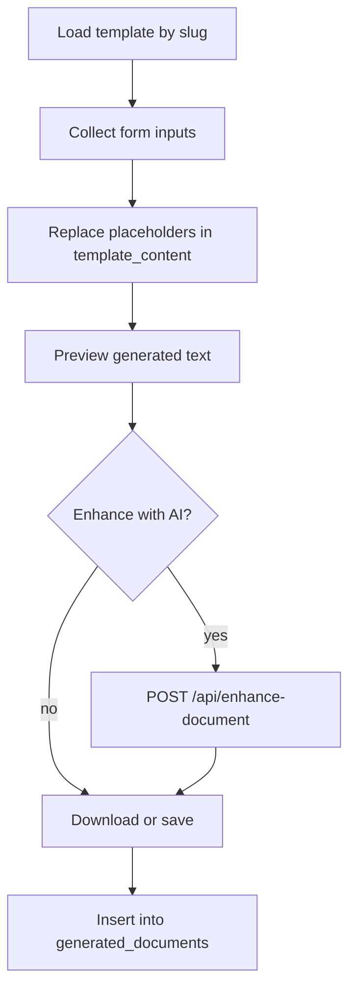

### 3) Bookmark toggling

[components/kyr-article-view.tsx](components/kyr-article-view.tsx) checks the current bookmark state, then calls `/api/bookmarks` to add or remove a row. The UI reflects the server response immediately.

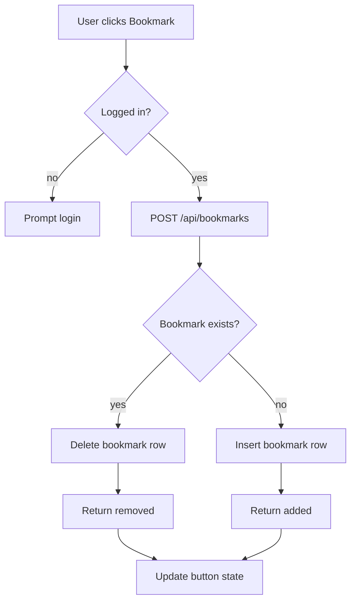

### 4) Consultation booking

[components/consultation-booking.tsx](components/consultation-booking.tsx) creates a consultation request, then simulates payment before updating the request status. The file currently updates to a `paid` status even though the schema in the inspected scripts does not define `paid` in the status check, so this path deserves careful verification.

### 5) Filtering and sorting

[components/lawyer-directory.tsx](components/lawyer-directory.tsx) and [components/stories-directory.tsx](components/stories-directory.tsx) use `useMemo` to avoid re-running filter/sort logic on every render. That is the main performance-sensitive logic in the UI.

### 6) Why the design looks the way it does

The codebase favors simple CRUD-like flows and local state over heavy client-side orchestration. That keeps the UI understandable, but it also means data consistency depends on the schema remaining aligned with the components. Where the schema and the UI drift apart, the app currently falls back to user-facing guidance instead of hard failures.

## 10. Testing

There is no automated test framework configured in the active root workspace. I did not find Jest, Vitest, Playwright, Cypress, or a `test` npm script in the inspected root package metadata.

Test strategy in practice:

- Unit: not configured.
- Integration: not configured.
- E2E: not configured.
- Manual: currently the only visible verification path.

How to run tests:

```bash
# Not configured in this repository root
npm test
```

That command is expected to fail until a test runner is added.

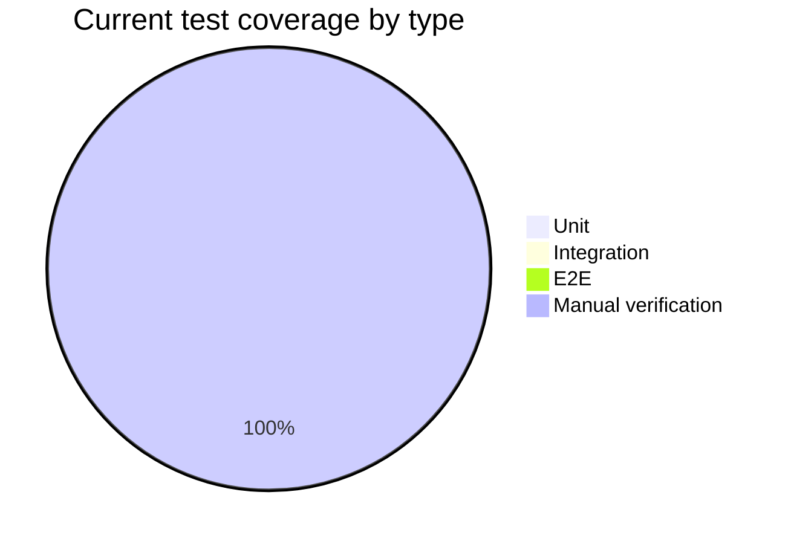

The goal should be to add at least smoke coverage for auth, chat session persistence, document generation, lawyer consultation booking, and bookmark toggling.

## 11. Deployment

There is no explicit deployment pipeline in the active root workspace. I did not find a `.github/workflows` directory, a `vercel.json`, Dockerfile, or other deployment configuration at the root.

Build and production commands available today:

```bash
npm run build
npm run start
```

Likely deployment target:

- Vercel is the most natural fit because this is a Next.js app with route handlers.
- Supabase hosts the database/auth layer.
- Puter.js is consumed from a CDN.

Rollback strategy:

- Without CI/CD, rollback is manual: redeploy a previous Git commit or revert the deployment on the hosting platform.
- Schema rollback is not automated either, so database changes should be versioned and applied cautiously.

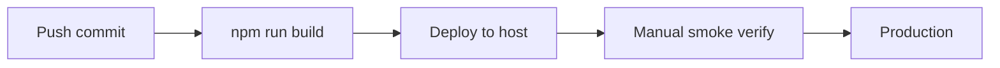

Architecture prompt for an image tool: a deployment pipeline illustration showing Git commits flowing into a Next.js build box, then to a Vercel-like cloud, with Supabase database and Puter.js CDN drawn as external dependencies.

## 12. Known Issues & Limitations

The codebase is useful, but it is not internally consistent yet. The most important limitations are structural, not cosmetic.

| Issue | Impact | Evidence |
|---|---|---|
| Duplicate schema families | High | `users` vs `user_profiles`, `bookmarks` vs `user_bookmarks`, `legal_stories` vs `case_stories`, `kyr_articles` vs `legal_articles` |
| Disabled build checks | High | `typescript.ignoreBuildErrors` and `eslint.ignoreDuringBuilds` in `next.config.mjs` |
| Unsupported config key | Medium | Next.js reports `eslint.ignoreDuringBuilds` as unsupported |
| No automated tests | High | No test runner or test scripts found |
| Server-side Puter usage is suspicious | High | `app/api/chat/route.ts` and `app/api/documents/enhance/route.ts` reference `global.puter` on the server |
| Consultation status mismatch | Medium | UI updates `consultation_requests.status` to `paid`, while the inspected schema check lists `pending`, `accepted`, `rejected`, `completed`, `cancelled` |
| Story flow drift | Medium | Components reference `legal_stories`, `story_comments`, `story_likes`, `story_categories`, while older scripts define `case_stories` families |
| Profile flow drift | Medium | [app/dashboard/profile/page.tsx](app/dashboard/profile/page.tsx) writes to `users`, while [app/dashboard/settings/page.tsx](app/dashboard/settings/page.tsx) reads `user_profiles` |

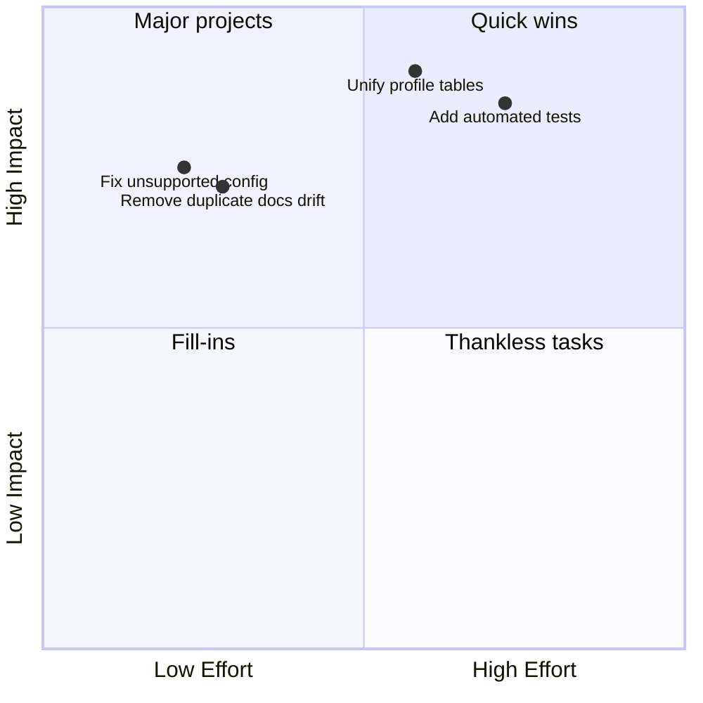

## 13. Contributing Guide

There is no formal contributor guide file, so this section infers conventions from the repo.

Branch naming:

- No enforced branch convention was found.
- A pragmatic convention would be `feature/<short-name>`, `fix/<short-name>`, or `docs/<short-name>`.

Commit message format:

- No formal commit template was found.
- The repository history appears to favor descriptive messages rather than a strict conventional-commit policy.

PR process:

- Open a branch, make the smallest coherent change, manually smoke-test, and include screenshots for UI work.
- Because the repo currently lacks tests, a review should explicitly call out any manual verification performed.

Code style / linting:

- TypeScript strict mode is enabled, but build-time TypeScript errors are ignored by config.
- Tailwind CSS is the styling system.
- Components are a mix of server and client components; file-level `"use client"` is used when browser APIs or hooks are needed.

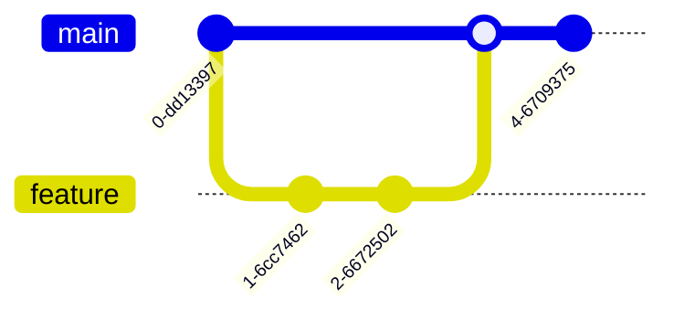

## 14. Changelog / Version History

No dedicated `CHANGELOG.md` exists in the active root workspace. Version history therefore has to be inferred from the repo shape and the visible scripts/docs.

What is inferable:

- The root app appears to be a v0-generated or v0-derived Next.js prototype.
- `README.md`, `DATABASE_SETUP.md`, `LAWYER_DIRECTORY_SETUP.md`, and `Technical_Appendix.md` document feature growth over time.
- The schema families evolved from earlier `case_stories` / `legal_articles` / `user_bookmarks` scripts toward the current `legal_stories` / `kyr_articles` / `bookmarks` app code.

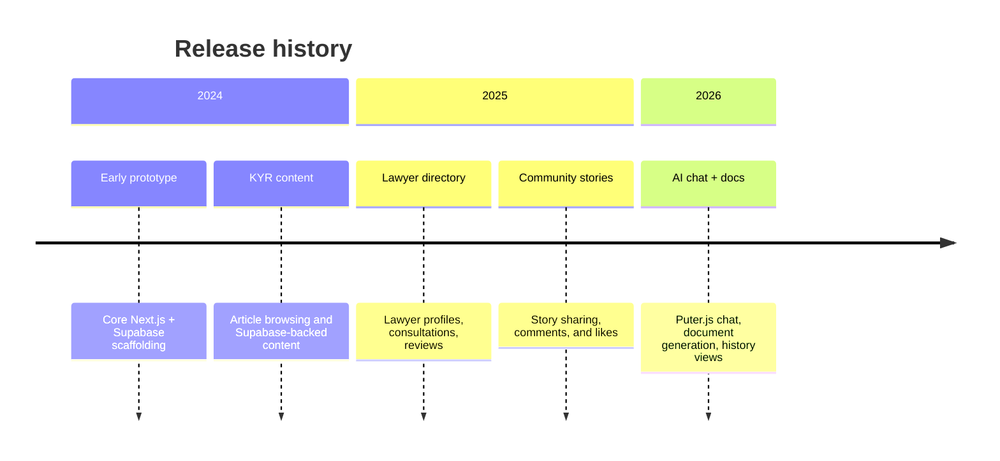

## 15. Glossary

This glossary defines the most common domain terms and naming patterns used in the codebase.

`KYR`
: Know Your Rights. The rights-education area under routes like `/kyr`, `/kyr/[category]`, and `/kyr/article/[slug]`.

`RLS`
: Row Level Security in Supabase/Postgres. It is the main authorization layer for most tables.

`Puter.js`
: A browser-loaded AI service used by the app for chat-style responses and document enhancement.

`sessionId`
: The identifier for an AI chat session in `chat_sessions` or a lawyer chat conversation in the lawyer chat flow.

`conversationId`
: The lawyer-chat conversation identifier returned by `/api/chat/start`.

`slug`
: URL-friendly text used in paths and content lookups, such as `kyr_articles.slug` or route folders like `[slug]`.

`case_type`
: The category of a legal story, such as `Family Law` or `Consumer Rights`.

`consultation_request`
: A request submitted by a user to a lawyer, containing subject, description, preferred time, and status.

`practice_areas`
: An array column on `lawyers` used to represent specialties in the directory UI.

`specialization mapping`
: The bridge table that links lawyers to one or more specialization rows.

`is_approved`
: A moderation flag used for KYR articles and stories so only approved content is publicly visible.

`is_anonymous`
: A privacy flag used by stories and comments to hide the author identity.

`NEXT_PUBLIC_*`
: Environment variables exposed to browser-side code by convention.

`updateSession`
: The helper in [lib/supabase/middleware.ts](lib/supabase/middleware.ts) that refreshes cookies and enforces redirects.

`extractPuterResponseText`
: The helper in [lib/puter-response.ts](lib/puter-response.ts) that normalizes multiple possible AI response shapes into plain text.

`generated_documents`
: Saved, user-owned legal documents produced by the template generator.

`legal_stories`
: The currently active story table used by the story pages and story UI.

`user_profiles`
: A table name referenced by some settings and story code, but not defined in the numbered scripts I inspected here. Treat it as an unresolved schema dependency unless you confirm it elsewhere.

`paid`
: A consultation status value set by the booking UI, even though the inspected schema script did not include it in the allowed `status` check.

---

If you are onboarding to this repository, the shortest reliable mental model is: Next.js App Router on the front end, Supabase on the back end, Puter.js for AI, and SQL scripts as the source of truth for the data model. The main thing to watch is schema drift between scripts and components.